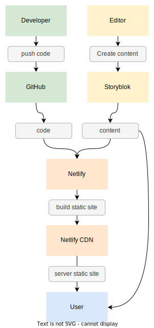

# GrandGarage - Website (vueJs)

This badly named repository contains the source code that powers the web application hosted at [grandgarage.eu](https://grandgarage.eu/).  It's a member portal to interface with services at Grand Garage, a makerspace in Linz, Austria.

  

## Dev Setup

1. **Install Dependencies**
   `yarn`

2. **Run local dev Server**
   `yarn run dev-local`

3. **Use netlify functions**  (works only with valid token)  
   `yarn lambda-staging`
 

### Prepare for Deployment

**Generate static HTML**
`yarn run generate`

  

## Tech Stack

| Platform  | Description / Link                                                                                                 |
|-----------|--------------------------------------------------------------------------------------------------------------------|
| NuxtJs    | a higher-level framework of the JS-framework [vuejs](https://vuejs.org/) / [official website](https://nuxtjs.org/) 
| Storyblok | a modern headless CMS / [official website](www.storyblok.com)                                                      |
| Netlify   | a build and deployment platform / [official website](https://www.netlify.com/with/vue/)                            |

 

  

## Contribute
We appreciate contributions of any kind. 

* clone or fork this repository
* get familiar with Nuxt.js
* contribute

We're also [looking for web developers](https://grandgarage.eu/de/jobs) to join our international remote IT team. If you're interested, just get in touch!
